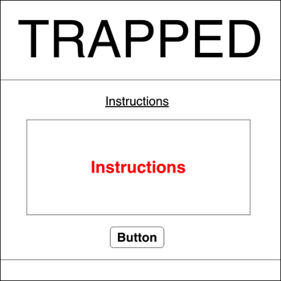
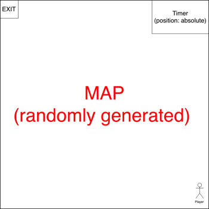

# Trapped

Trapped is a web based arcade style game where players navigate their avatars through a maze, avoiding enemies to get to the exit on the opposite end of the screen.

Skills used for the project includes:

1. HTML5
2. CSS3
3. Javascript
4. Bootstrap

## Wireframes

## Gameplay

Visit [this page](https://trap.netlify.com) to try out the game.
